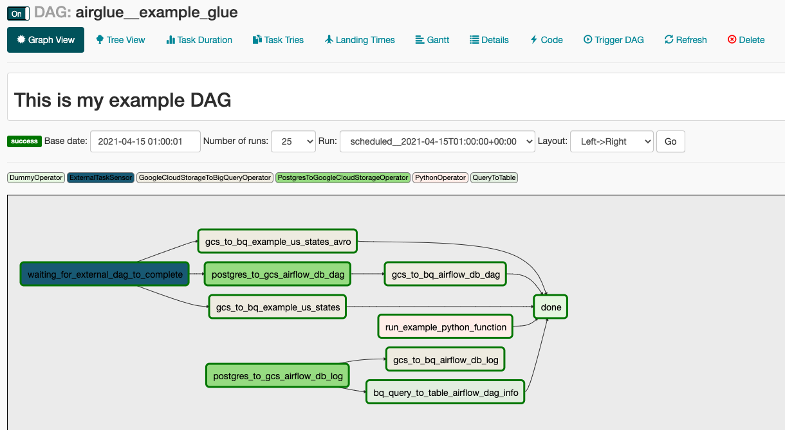
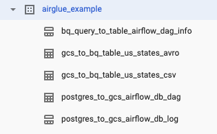

# Airglue
Create Airflow DAGs and orchestrate dependencies between Operators can be somewhat repetitive and not easy for users without a programming background. 
Airglue's configuration driven approach makes this easy to manage without needing to write any Python at all.

## TOC
* [Design Concept](#design-concept)
* [Key Features](#key-features)
* [Getting Started](#getting-started)
   * [Prerequisites](#prerequisites)
   * [Build and Start up](#build-and-start-up)
   * [Start up without building](#start-up-without-building)
   * [Shut down](#shut-down)
   * [Restart](#restart)
   * [Inspect Container Logs](#inspect-container-logs)
   * [SSH into the container](#ssh-into-the-container)
   * [Example DAG](#example-dag)
   * [DAG Configuration Explained](#dag-configuration-explained)
      * [The following structure is used to define a DAG](#the-following-structure-is-used-to-define-a-dag)
      * [The following structure is used to define a task within a DAG](#the-following-structure-is-used-to-define-a-task-within-a-dag)
   * [Custom Operator](#custom-operator)
   * [Operator Factory](#operator-factory)
   * [Airflow / Cloud Composer Versions](#airflow--cloud-composer-versions)
* [TODO](#todo)
* [Credits](#credits)

## Design Concept
By defining a YAML config such as the one in [this example](airglue/example/example_glue/config.yaml), you would be able to dynamically create a complex DAG flow like this   


With powerful templating & rendering   


And producing output to these tables in BigQuery   


For more details on exactly how this works, see [Example DAG](#example-dag) and [DAG Configuration Explained](#dag-configuration-explained)

## Key Features
- User can create DAGs and manage Operator dependencies through a simple YAML file
- Plugin based architecture allows components such as custom Operators and Operator Factory classes to be added which helps eliminate most duplication
- Environment, Airflow and static variables can all be defined in the YAML and made available through `{{ params }}` ready to be used in the Airflow templating context

## Getting Started
The following instructions will get Airglue up and running in Docker on your laptop (Mac or Linux). 
The whole process should only take around 10-15 minutes depending on your internet connection speed. 

### Prerequisites
1) Have [Docker Desktop](https://www.docker.com/products/docker-desktop) installed
1) Create a service account with appropriate roles and save the key to `~/.config/gcloud/airglue/airglue-sandbox-sa.json` on your local machine. 
    > The reason service account impersonation is not used is due to there is no support on Airflow V1 to the built-in operators.
    > It is important to rotate the key regularly when using service account keys. 
    > Airflow V2 made this available via the `impersonation_chain` argument. 
    > See https://airflow.apache.org/docs/apache-airflow-providers-google/stable/_api/airflow/providers/google/cloud/operators/bigquery/index.html 

### Build and Start up
```
make build
```

Go to `localhost:8082`

You should how see the example DAG and to get started, see the [example dag here](airglue/example/example_glue).

### Start up without building
It is quicker to start up Airglue without re-building each time
```
make up
```

### Shut down
```
make down
```

### Restart
```
make restart
```

### Inspect Container Logs
```
make logs
```

### SSH into the container
```
make exec
```

### Example DAG
There is an example DAG created in this repository called [example_glue](airglue/example/example_glue). It is designed to be a `show case` DAG that demos a lot of supported features in Airglue. 

In order for this DAG to work, the `make` command must be executed with the following variables
- `AIRGLUE_SANDBOX_PROJECT_ID`: A GCP project id for your sandbox environment.
- `AIRGLUE_EXAMPLE_BUCKET_NAME`: An example GCS bucket used to persist data. The service account must be able to write into this bucket.

And to run the example DAG use something like
```
make build AIRGLUE_SANDBOX_PROJECT_ID={replace me} AIRGLUE_EXAMPLE_BUCKET_NAME={replace me}
```
### DAG Configuration Explained
#### The following structure is used to define a DAG
```yaml
enabled: {optional: true|false. Enable or disable the DAG, default is true if not specified. Disabled DAGs won't show up in the Airflow GUI}
schedule_interval: {required: a valid CRON expression used to setup DAG schedule, if no schedule is required, set to `null`. i.e. "0 2 * * *" or null. You may use https://crontab.guru/ to validate your CRON expression}
timezone: {required: timezone for the schedule. I.e. "Europe/London". Local time is always preferred so that processing can be done exactly at the right time for the correct data boundaries}
params: {optional: params to be loaded and made available as {{ params }} in any context in Airflow with Jinja templating enabled. 3 types of params can be loaded}
  default_dataset: airglue_example # This is a static param type which will be made available directly under {{ params }}. i.e. {{ params.default_dataset }}
  envs: # This is for Environment variables and the ones defined will be made available as {{ params.envs.<name> }}, undefined ones will be omitted
    - AIRGLUE_SANDBOX_PROJECT_ID
  vars: # This is for Airflow variables and the ones defined will be made available as {{ params.vars.<name> }}, undefined ones will be omitted
    - example_bucket_name
```
To to the [Example DAG](airglue/example/example_glue) to see a working version of this.

#### The following structure is used to define a task within a DAG
```yaml
- identifier: {required: identifier for the task, must be unique within a DAG}
  operator: {required: fully qualified airflow operator name, i.e. airflow.contrib.operators.gcs_to_bq.GoogleCloudStorageToBigQueryOperator}
  operator_factory: {optional: fully qualified operator factory name, i.e. airglue.contrib.operator_factory.default.DefaultOperatorFactory, but if `DefaultOperatorFactory` is all that is required, this arguments can be omitted}
  arguments:
    {optional: key value pairs translated into Airflow Operator arguments. i.e. source_format: "NEWLINE_DELIMITED_JSON"} 
  dependencies:
    {optional: a list of task identifiers this task depends on, used to create the link between Airflow Operators within a DAG}
```
To to the [Example DAG](airglue/example/example_glue) to see a working version of this.

### Custom Operator
Under [airglue/contrib/operator](airglue/contrib/operator), custom Airflow Operators can be defined if Airflow does not have one to fulfill the requirements or you simply prefer to write your own so that there is no limit to what Airglue can execute.

See  [airglue/contrib/operator/bigquery/query_runner.py](airglue/contrib/operator/bigquery/query_runner.py) as an example.

### Operator Factory
Operator Factory is a concept introduced to make the configuration file more compact and easier to read, it can also be used to define common abstractions so that the configuration file becomes smaller hence much quicker to add new integrations.

Operator Factories can be added to [airglue/contrib/operator_factory](airglue/contrib/operator_factory) and by default the [default](airglue/contrib/operator_factory/default.py) Operator Factory is used.

### Airflow / Cloud Composer Versions
In order to make the setup compatible with [Cloud Composer](https://cloud.google.com/composer) as much as possible, we've created a separate release for each Composer version under [Local Docker Release](infrastructure/docker/release). 
There is a default one specified in the `Makefile` which is the latest supported version by Cloud Composer, but it can be overwritten by passing in `AIRGLUE_COMPOSER_AIRFLOW_VERSION` when running any `make` command. 
I.e. 
```
make build AIRGLUE_COMPOSER_AIRFLOW_VERSION=1.10.10
```

We aim to align the Airflow support to the latest 3 versions on Cloud Composer. Any older versions will still be available in the repository but will no longer be supported.
See [Composer versions](https://cloud.google.com/composer/docs/concepts/versioning/composer-versions) to check what are the latest versions.  

## TODO
- Windows user support

## Credits
This application uses Open Source components. You can find the source code of their open source projects along with license information below. We acknowledge and are grateful to these developers for their contributions to open source.

Project: DOP https://github.com/teamdatatonic/dop   
Copyright (c) 2021 Datatonic   
License MIT https://github.com/teamdatatonic/dop/blob/master/LICENSE.md   